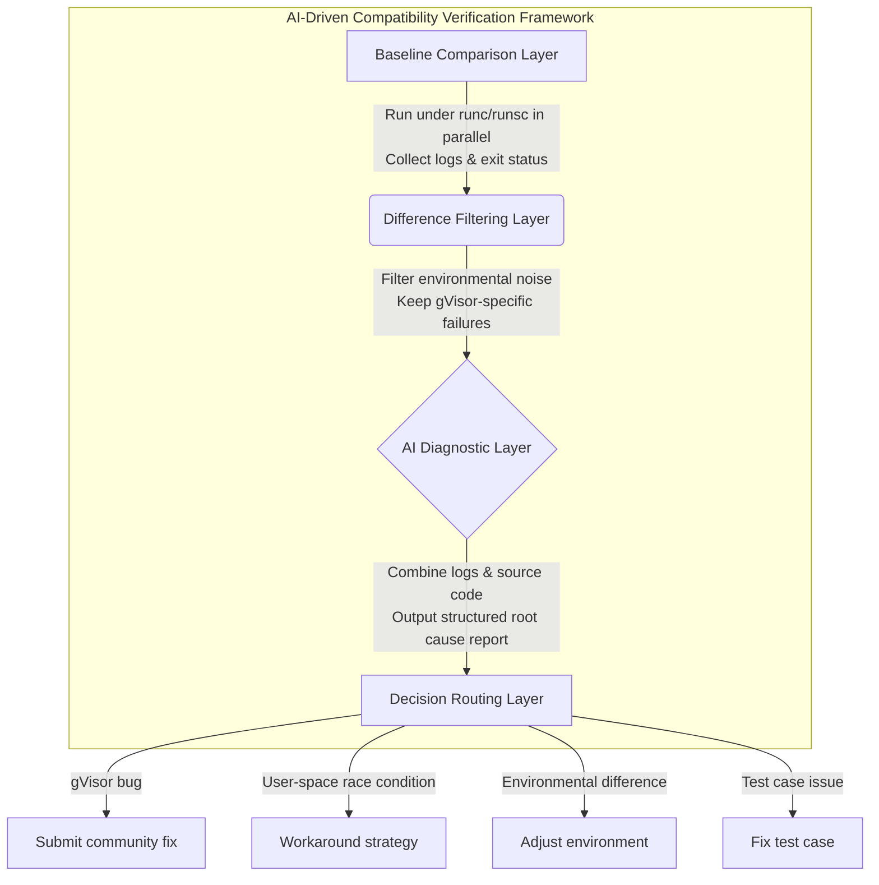

# Scaling Agentic-RL Sandboxes to the Millions with gVisor at Tencent

> *This article was contributed by [Tencent](https://www.tencent.com/). Yifeng
> Tan, Hua Liu, and Hui Chen are engineers at Tencent, responsible for the
> internal container infrastructure.*

As LLMs evolve from chat interfaces to autonomous agents, building a robust and
secure isolation environment becomes a necessity. We chose
[gVisor](https://gvisor.dev) as the default sandbox for our Agentic-RL
scenarios. Today, we run millions of gVisor sandboxes daily for Agentic-RL
training in production, and that scale continues to grow. After more than
**74,000** side-by-side comparisons between runsc and runc, combined with
targeted fixes driven by real-world workloads, we have essentially closed the
execution correctness gap with runc, fully meeting our production-grade business
requirements. During this process, we successfully investigated and resolved
gVisor compatibility issues that accounted for approximately **1.7%** of all
test cases.

This post focuses on CPU-centric code execution and testing workloads. We will
discuss gVisor compatibility verification and highlight representative issues,
skipping implementation details like GPU support, image distribution, or cluster
scheduling. We aim to answer three questions: 1. Why choose gVisor? 2. Why
doesn't manual compatibility verification scale? 3. How can AI agents analyze
compatibility issues, what do typical failures look like, and what best
practices have we established?

<!--/excerpt-->

## Background: Why Agentic-RL Needs gVisor

Over the past two years, benchmarks like SWE-bench have turned "Agents fixing
bugs in real code repositories" from a research concept into an engineering
reality. The agent behavioral model has evolved from **static code generation**
to **dynamic environmental interaction**, spanning the entire lifecycle of
dependency resolution, execution, test feedback, and iterative debugging. We
don't just need "an environment that runs Docker," but rather a sandbox that
strictly constrains the kernel attack surface while remaining lightweight and
easy to deploy at scale. [gVisor](https://gvisor.dev) is a great fit for this
scenario: - It implements an application-level kernel in user space,
intercepting and re-implementing system calls, significantly reducing the attack
surface where containers directly interact with the host kernel. Its isolation
has been well-recognized by the industry. - It integrates naturally with
existing Docker/Kubernetes infrastructure, avoiding the need for an entirely new
guest kernel operation and maintenance system. - Compared to microVM
solutions—which must run on bare-metal hosts—gVisor can run inside regular VMs,
making it significantly cheaper while remaining more flexible with lower startup
and resource costs. This makes it far better suited for large-scale deployments
of sandbox containers. - It is also more friendly to GPU scenarios, facilitating
integration with existing heterogeneous computing environments.

However, **re-implementing the Linux ABI means its compatibility must be
rigorously validated.** In an Agentic-RL scenario where "any project can run and
any environment can appear," compatibility can't rely on intuition. It requires
large-scale verification against real workloads.

## Challenge: Verifying Tens of Thousands of Cases Cannot Rely Entirely on Manual Effort

Compatibility issues are rarely simple. Analyzing a typical SWE-related failure
usually requires answering several questions at once:

1.  Is this failure unique to runsc, or does it also fail under runc?
2.  If it only fails under gVisor, is it a semantic inconsistency in the Linux
    ABI, missing procfs / sysfs, file system behavioral differences, or a TOCTOU
    (Time-of-Check to Time-of-Use) race condition amplified by system call
    overhead?
3.  What is the actual behavior of the Linux kernel? At which layer did gVisor
    deviate?
4.  Should this issue be addressed by patching gVisor, modifying the test case,
    adjusting configurations, or simply avoiding a certain way of running?

Engineers can handle a handful of cases manually. But across these datasets, we
are dealing with hundreds of thousands of real-world project instances, over a
dozen programming languages, and numerous build systems (Gradle, Maven, CMake,
Cargo, pip, npm, sbt, SwiftPM). Manual triage simply doesn't scale.

To solve this, we brought AI coding agents into the verification pipeline to act
as **compatibility analysts**. The process breaks down into four layers:

-   **Baseline Comparison Layer**: Run the same set of test cases in parallel
    under runc and runsc, collecting complete execution logs and exit statuses.
-   **Difference Filtering Layer**: Filter out environmental noise and
    non-deterministic outputs unrelated to the runtime, preserving samples that
    only fail under gVisor.
-   **AI Diagnostic Layer**: LLMs output structured root cause analysis reports
    by combining logs and relevant source code.
-   **Decision Routing Layer**: Route the reports into gVisor bugs, user-space
    race conditions, environmental differences, or test case issues, providing
    suggestions for fixes or workarounds.

This creates a neat closed loop: **AI analyzing its own runtime environment.**

In our workflow, every deeply analyzed case produces a structured document,
typically containing:

-   Failure symptoms and minimal reproduction method
-   runc/runsc comparison results
-   Root cause classification: gVisor bug, missing feature, environmental
    difference, test case issue, or race condition amplification
-   Linux kernel behavior comparison and source code evidence
-   Fixes or workaround suggestions
-   Regression verification results

To date, we have used AI to automatically analyze **thousands of test cases
exhibiting behavioral differences**. From these, we extracted and deeply
reviewed **100+ highly representative cases** across **10+ programming
languages** and multiple build systems. These cases help us determine not only
"whether gVisor is usable," but also "who is actually to blame for a given
failure."

## Compatibility Landscape: Boundaries Defined by Batch Comparisons

Looking at a small sample of failures makes it easy to misjudge gVisor's
compatibility. Reliable conclusions require large-scale A/B testing.

Across 10 mainstream code execution datasets in our Agentic-RL infrastructure,
we've run **74,379** side-by-side comparisons between `runc` and `runsc`.

Please see the detailed data in the table below:

Dataset                           | Total Cases | runc Accuracy | Pre-fix runsc Accuracy | Post-fix runsc Accuracy
--------------------------------- | ----------: | ------------: | ---------------------: | ----------------------:
terminal-bench2                   | 89          | 100.00%       | 94.38%                 | 97.75%
swe-public/Multi-SWE-bench        | 1,632       | 70.16%        | 72.49%                 | 73.16%
swe-public/Multi-SWE-RL           | 7,046       | 27.73%        | 20.49%                 | 26.81%
swe-public/SWE-bench_Multilingual | 300         | 93.00%        | 92.67%                 | 93.00%
swe-public/SWE-bench_Not_Verified | 1,794       | 97.94%        | 97.94%                 | 97.94%
swe-public/SWE-bench_Pro          | 731         | 90.15%        | 90.97%                 | 90.97%
swe-public/SWE-bench_Verified     | 500         | 100.00%       | 99.60%                 | 100.00%
swe-public/SWE-Gym                | 2,438       | 86.75%        | 88.27%                 | 88.27%
swe-public/SWE-rebench            | 21,336      | 83.33%        | 83.33%                 | 83.77%
swe-public/SWE-smith              | 38,513      | 99.37%        | 97.42%                 | 99.31%
**Total**                         | **74,379**  | **86.78%**    | **85.18%**             | **86.91%**

Three key takeaways emerge from this data:

-   **runsc and runc are now effectively on par.** Across 74,379 runs, the
    correctness gap between runsc and runc is only about **0.13 percentage
    points** (86.91% vs 86.78%). We also performed retries and cross-validation
    on core datasets to rule out one-off flakiness. We have improved runsc's
    overall pass rate by approximately **1.7 percentage points**. This
    correctness gain largely stemmed from highly concentrated failures in a
    small number of repositories—such as trio, cloud-custodian, asciidoctor, and
    syncthing. Once a root cause was identified, a single fix could often
    resolve hundreds of failing cases at once.
-   **Most "compatibility issues" should not be attributed to gVisor.** The
    table clearly demonstrates that even under the native runc environment,
    there is an inherent failure rate of about 13% (with an average correctness
    of 86.91%). These failures largely stem from flaky test code, build
    environment deficiencies, or limitations within the underlying datasets.
    Evaluating gVisor without a runc baseline could easily lead to
    misattributing this 13% background failure rate as sandbox
    incompatibilities.
-   **The overall pass rate for Multi-SWE-RL is relatively low (around ~27% for
    both runtimes).** This is because our internal evaluation framework and some
    case-execution methods are still being adapted, so it is not a standalone
    compatibility problem in gVisor itself. The same bias affects both runc and
    runsc, and therefore does not change the comparative conclusion.

At the production scale we described earlier—**millions of gVisor sandboxes
running every day**—this data answers the real question: how much correctness do
we lose by replacing runc with runsc? The answer is: **almost none.**

## Representative Cases: Six Types of Issues and Corresponding Fix Paths

After filtering out cases where both runc and runsc failed simultaneously, we
conducted in-depth reviews of the remaining cases that exhibited behavioral
differences. Using these 100+ representative cases as a sample, their final
root-cause attribution can roughly be divided into the following categories:

| Root Cause Category  | Requires gVisor | Typical Examples             |
:                      : Modification?   :                              :
| -------------------- | --------------- | ---------------------------- |
| **Genuine gVisor     | Yes             | `poll` incorrectly modifying |
: bugs**               :                 : `events`, inconsistent       :
:                      :                 : `execve` `errno` returns,    :
:                      :                 : `O_TRUNC` missing            :
:                      :                 : `IN_MODIFY` inotify events   :
| **Missing syscalls   | Yes             | Unimplemented                |
: and virtual FS       :                 : `copy_file_range` syscall,   :
: entries**            :                 : missing                      :
:                      :                 : `/proc/sys/fs/pipe-max-size` :
:                      :                 : configuration file, and      :
:                      :                 : absence of `/sys/dev/block`  :
:                      :                 : directory                    :
| **Clock and timer    | Partially       | CPU clock measurement        |
: precision            :                 : precision, monotonic clock   :
: differences**        :                 : start value differences,     :
:                      :                 : sleep duration jitter        :
| **Amplified race     | No              | Gradle `clean test` parallel |
: conditions**         :                 : execution concurrency race,  :
:                      :                 : CMake `copy_if_different`    :
:                      :                 : TOCTOU race                  :
| **Environmental or   | No              | External network access      |
: config differences** :                 : restrictions, JDK version    :
:                      :                 : mismatches, missing dynamic  :
:                      :                 : library paths                :
| **Test case issues** | No              | Test execution order         |
:                      :                 : dependencies, underlying     :
:                      :                 : dataset defects, inherently  :
:                      :                 : flaky tests                  :

This shows that aside from genuine bugs or missing Linux ABI implementations in
gVisor, a significant portion of behavioral differences stems from
timing-sensitive tests, amplified user-space race conditions, or environmental
setup differences. This is especially crucial for Agentic-RL scenarios. Without
runc baselines and root cause analysis, these failures could easily be
misattributed as sandbox incompatibilities, leading to systematically
pessimistic conclusions.

These cases highlight the different types of compatibility issues we see in
Agentic-RL: system call semantic deviations, Linux ABI gaps, VFS implementation
gaps, and user-space race conditions.

### Case 1: poll Behavior Inconsistency Causes tmux Busy-Loop

The evaluation cluster's CPU utilization was unusually high. Investigation
revealed that the tmux server in each Agent container was pegging a CPU core:
under gVisor, CPU usage hovered at **96.6%**, while under runc it was
practically **0%**.

The root cause was poll write-back semantics. gVisor internally appended
`POLLHUP|POLLERR` to `pollfd.events` and wrote the entire `pollfd` struct back
to user space. Linux, however, only writes to `revents` and **never modifies the
user's original `events`**. This discrepancy prevented libevent from properly
removing closed file descriptors. Subsequent poll calls immediately returned
`POLLNVAL`, triggering a busy-loop.

After fixing this, the tmux CPU dropped from 96.6% to 0%. The impact goes far
beyond tmux—any program relying on the libevent poll backend benefits from this.

### Case 2: syncthing Test Case Exposes Two Independent Linux ABI Gaps (Unimplemented Syscalls or Virtual Files)

In real-world workloads, it's not uncommon for a single test case to hit two
independent gVisor compatibility issues at once. The syncthing__syncthing-7828
test case in the Multi-SWE-RL dataset passes normally under runc, but
consistently fails under runsc: 16 `TestCopyRange/*` subtests report `function
not implemented`, and another `TestTruncateFileOnly` times out waiting for an
inotify event.

This was caused by two independent Linux ABI gaps:

-   **`copy_file_range` (syscall 326) was unimplemented.** gVisor registered it
    as `ErrorWithEvent(ENOSYS)`, so any program using this syscall received
    `function not implemented`.
-   **`open(O_TRUNC)` was missing the `IN_MODIFY` inotify event.** The Linux
    kernel generates `IN_MODIFY` along the `do_open()` → `handle_truncate()` →
    `notify_change()` path. However, gVisor VFS's `OpenAt` only generated
    `IN_OPEN`, causing programs listening for file modification events to be
    "deaf" to the truncation action.

The fix proceeded along two lines: implementing `copy_file_range` for both amd64
(326) and arm64 (285), and issuing `IN_MODIFY` at the VFS layer for `O_TRUNC` on
non-newly created files (skipping it for newly created files via the
`FMODE_CREATED` flag, consistent with Linux). After the fix, this test case
passed consistently under runsc just like under runc.

### Case 3: Gradle clean test Concurrency Race—Root Cause in User Space, Not gVisor

Not all issues that "only reproduce under gVisor" are actually gVisor bugs.

A Thunderbird Android test running `./gradlew clean test --max-workers 8
--continue` under runsc frequently failed with `Unable to delete directory`.
However, running it 7 times under runc yielded **5 failures** (71%). This
pointed to a user-space TOCTOU race condition in Gradle's parallel build: one
subproject was still writing to `build/`, while another subproject's clean task
was already trying to delete it.

gVisor's higher system call overhead amplified the probability of triggering
this race, but it did not introduce new semantic errors. Splitting the command
into `./gradlew clean` and `./gradlew test ...` fixed it completely. **This is
also a fundamental principle we follow in compatibility analysis: always use
runc as a baseline first, then determine whether the issue should be attributed
to the sandbox itself.**

### Case 4: Missing procfs / sysfs Causes Real Applications to Take Abnormal Paths

Agentic-RL workloads are full of paths that are not usually tested in isolation
but are relied upon by real projects, such as `/proc/sys/fs/pipe-max-size`,
`/proc/sys/kernel/randomize_va_space`, `/sys/dev/block`, `/proc/[pid]/fdinfo`,
etc. Once missing, these typically manifest as `ENOENT` or cause upper-layer
libraries to take abnormal code paths.

These are usually cheap to fix by wiring up static files or directory
structures. They perfectly illustrate the value of real-world workloads: **we
aren't adding these paths to satisfy a benchmark, we're adding them because real
applications actually read them.**

### Case 5: Inconsistent PTY Implementation Causes Interactive Agents to Error

Interactive terminals are easily overlooked but heavily used in Agent systems
(tmux, screen, expect, REPLs, etc.). All rely on PTYs. We fixed several
inconsistencies here:

-   The `ISIG` flag was not checked correctly, causing signals to still be
    generated after `stty -isig`.
-   When the master closed, it did not send `SIGHUP` to the foreground process
    group as Linux does.
-   `TCSBRK` / `TCFLSH` and other ioctls were missing or had incorrect
    directional semantics, affecting programs like pyserial.

Notably, `TCFLSH` semantics must be evaluated from the **caller's perspective**
rather than hardcoding internal queue names. Otherwise, the flush directions
seen by the master and replica are reversed compared to Linux.

### Case 6: Jekyll Test Order Dependency Causes Flaky Failures—A Pure Test Case Issue

Sometimes, a test failing under gVisor has nothing to do with the runtime
environment at all.

During evaluation, a Jekyll test case (`jekyll-7637`) failed under runsc but
coincidentally passed under runc. After a deep dive, we found that this test
actually had a roughly 33% chance of failing in *any* environment.

The root cause was rather dramatic: the test code itself had a bug where it
passed a configuration value as a Ruby `Symbol` type, while the underlying
source code incorrectly compared it as a `String`. As a result, this test could
**never** load its required syntax highlighting plugin as intended. So why did
it sometimes pass? Because the testing framework (`minitest`) executes tests in
a randomized order. If this buggy test happened to run **after** another test
that correctly loaded the plugin into memory, it would "freeload" off that
global state and pass. But if the randomized order happened to put this test
first, it would genuinely fail. It just so happened that gVisor hit that 1-in-3
failure chance during our evaluation.

This perfectly illustrates why we need large-scale A/B testing and deep
analysis: without them, sporadic test flakiness like this can easily be
misdiagnosed as "sandbox instability."

## Best Practices: Suggestions for Using gVisor in Agentic-RL Scenarios

If you're building an Agent execution environment with gVisor, here are some
practical tips.

### Suggestions for Different Build Systems

| Build System           | Common Risks             | Suggestions              |
| ---------------------- | ------------------------ | ------------------------ |
| **Gradle**             | clean test concurrency   | Split into clean and     |
:                        : race                     : test steps               :
| **Maven**              | Remote dependency        | Pre-populate local repo  |
:                        : download timeout or 403  : cache, minimize online   :
:                        :                          : downloads                :
| **CMake**              | `copy_if_different` race | Lower parallelism, avoid |
:                        : conditions               : over-reliance on         :
:                        :                          : extremely short time     :
:                        :                          : windows                  :
| **sbt / Scala**        | Deep stack, slow         | Increase `-Xss`, give    |
:                        : startup, test flakiness  : the first compilation a  :
:                        :                          : more generous timeout    :
| **pip / pytest**       | Differences in CPU count | Be aware of the          |
:                        : vs cgroup quota          : relationship between     :
:                        : perception               : `os.cpu_count()` and     :
:                        :                          : actual quotas            :
| **Cargo / npm / yarn** | Generally good           | Usually do not require   |
:                        : compatibility            : special handling         :

### Debugging Procedure When Encountering Failures

When a test fails, we recommend this debugging flow:

1.  First reproduce the same command under runc to confirm if the failure is
    specific to gVisor.
2.  If runc also fails, prioritize investigating test case issues, environmental
    differences, or race conditions.
3.  If it only fails under gVisor, check for obvious missing syscalls, procfs,
    or sysfs.
4.  For issues with no obvious missing features, compare logs, strace, and
    runtime behavior to distinguish between semantic inconsistencies, amplified
    race conditions, or environmental configuration differences.
5.  Only after confirming it is a gVisor semantic issue, proceed to locate the
    code path, create a minimal reproduction, and add regression tests.

Note: Many perceived "gVisor compatibility issues" are ultimately reclassified
as test case issues during this step.

## AI-Driven Compatibility Analysis: Why This Path Is Feasible

Large-scale compatibility analysis is well suited to AI assistance because it
involves a large amount of repetitive, context-heavy work:

-   Reading project source code and build scripts
-   Comparing behavioral differences between two runtimes
-   Comparing syscall, procfs, sysfs, PTY, network, and VFS semantics
-   Turning conclusions into executable patches, PRs, or workaround suggestions
-   Running regression validation and re-investigating the issue when validation
    fails

Manual analysis does not scale, while hardcoded rules often break down on
complex cases. AI agents fit naturally in the middle: they can take on most of
the "read logs → categorize → locate → report" work, while human engineers still
review the proposed approach and code.

The real value here is not just saving time; it is making our conclusions
**scalable, traceable, and continuously improvable**:

-   Every case has standardized analysis artifacts rather than scattered chat
    logs.
-   Every fix can be validated again against the original real-world test case.
-   Every case that is "not a gVisor issue" can still be turned into a concrete
    workaround playbook.
-   As new datasets, images, or build systems arrive, the same analysis
    framework can be reused.

Through this method, we already have more than ten fixes merged into the gVisor
mainline, covering multiple areas such as file systems, networking, proc/sysfs,
PTY, and system call semantics. Some representative PRs are listed below:

PR                                                    | Fix Content                                     | Typical Agentic-RL Scenario
----------------------------------------------------- | ----------------------------------------------- | ---------------------------
[#12851](https://github.com/google/gvisor/pull/12851) | poll: Only write back `revents`                 | tmux, libevent poll backend
[#12911](https://github.com/google/gvisor/pull/12911) | proc: Add `/proc/sys/fs/pipe-max-size`          | Python libraries like wurlitzer
[#12915](https://github.com/google/gvisor/pull/12915) | pty: Implement `TCSBRK` / `TCFLSH`              | pyserial, interactive PTY programs
[#12814](https://github.com/google/gvisor/pull/12814) | proc: Add `randomize_va_space`                  | Performance and security inspection tools
[#12813](https://github.com/google/gvisor/pull/12813) | sysfs: Add `/sys/dev/block` and `/sys/dev/char` | lsblk, device-related tools
[#12819](https://github.com/google/gvisor/pull/12819) | proc: Fill in `fdinfo` fields                   | lsof, fuser, diagnostic tools
[#12786](https://github.com/google/gvisor/pull/12786) | devpts: Fix `ISIG` check                        | Interactive shells / terminal-based agents
[#12853](https://github.com/google/gvisor/pull/12853) | vfs: `FICLONE*` returns `EOPNOTSUPP`            | file copying tools

In this sense, Agentic-RL is not just a new use case for gVisor; it has also
pushed our compatibility engineering toward a more AI-driven workflow.

## Conclusion

Agentic-RL is both a proving ground for gVisor and, in practice, a **large-scale
regression suite**: it continuously drives real-world projects through the
sandbox and exposes compatibility boundaries that standard unit tests struggle
to cover. By bringing AI agents into this verification loop, we can evaluate
gVisor's production readiness with data rather than intuition.

Our conclusions are simple:

1.  **gVisor's compatibility has proven to be production-ready.**
2.  **Most "compatibility issues" should not actually be attributed to gVisor.**
3.  **Real-world workloads are better than handpicked tests at revealing
    critical problems.**
4.  **AI-driven compatibility analysis is practical.**

As AI agents take on heavier tasks, the code-execution sandbox will become an
indispensable security foundation. We will continue refining this AI-driven
verification system, applying it to new datasets and language stacks, and
upstreaming our findings to the gVisor community. For Agentic-RL, a good sandbox
is not just secure—it also needs to be **highly compatible, debuggable, and able
to evolve alongside real-world workloads.**
